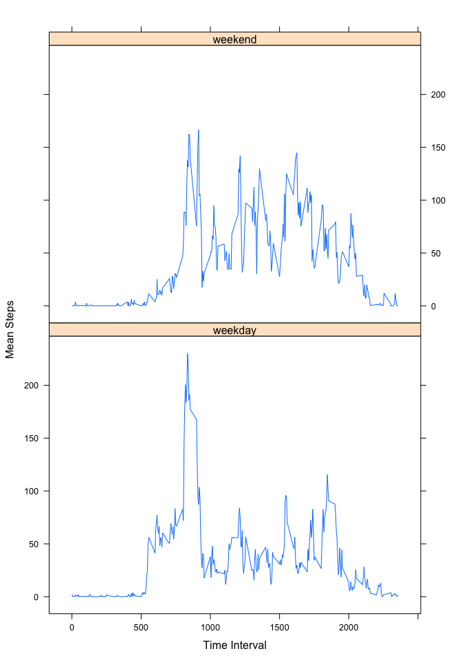

# Reproducible Research: Peer Assessment 1
## Introduction
The purpose of this report is to display the results of exploratory data analysis of human activity data as measured by the embedded gyroscope and accelerometer a personal activity monitoring device.

The data consists of two months of data from an anonymous individual collected during the months of October and November, 2012 and includes the number of steps taken in 5 minute intervals each day.

The variables included in this dataset are:  
* steps: Number of steps taking in a 5-min interval (missing values are coded as NA).  
* date: The date on which the measurement was taken in YYYY-MM-DD format.  
* interval: Identifier for the 5-min interval in which measurement was taken.  

The dataset is stored in a comma-separated-value (CSV) file and there are a total of 
17,568 observations in this dataset.

## Loading and preprocessing the data

**Note:** The code included assumes that the *dplyr* package is installed.
Load *dplyr* library:

```r
library(dplyr)
```

```
## 
## Attaching package: 'dplyr'
```

```
## The following objects are masked from 'package:stats':
## 
##     filter, lag
```

```
## The following objects are masked from 'package:base':
## 
##     intersect, setdiff, setequal, union
```

Read in the Activity data from the CSV file:

```r
activity.data <- read.table("../data/activity.csv",sep=",", 
                            colClasses=c("integer","Date","integer"),
                            header=TRUE)
```

The structure of the data table is as follows:

```r
str(activity.data)
```

```
## 'data.frame':	17568 obs. of  3 variables:
##  $ steps   : int  NA NA NA NA NA NA NA NA NA NA ...
##  $ date    : Date, format: "2012-10-01" "2012-10-01" ...
##  $ interval: int  0 5 10 15 20 25 30 35 40 45 ...
```
A summary of the data is shown below:

```r
summary(activity.data)
```

```
##      steps             date               interval     
##  Min.   :  0.00   Min.   :2012-10-01   Min.   :   0.0  
##  1st Qu.:  0.00   1st Qu.:2012-10-16   1st Qu.: 588.8  
##  Median :  0.00   Median :2012-10-31   Median :1177.5  
##  Mean   : 37.38   Mean   :2012-10-31   Mean   :1177.5  
##  3rd Qu.: 12.00   3rd Qu.:2012-11-15   3rd Qu.:1766.2  
##  Max.   :806.00   Max.   :2012-11-30   Max.   :2355.0  
##  NA's   :2304
```

## What is mean total number of steps taken per day?
Calculate the total number of steps taken each day.  To do this data is grouped by *day* and sum of each group is calculated.

```r
daily.activity<-select(activity.data,date,steps)  ## subset data to just the columns we need

daily.activity <- group_by(daily.activity,date)  ##  Group data by date

daily.activity <- summarise_each(daily.activity,funs(sum(steps)))  ## sum the data for each date
```
Create a histogram plot of the total steps taken each day:

```r
par(mfrow = c(1, 1))  ## Specify that plots will be arranged in 1 rows of 1 plots

with(daily.activity,hist(steps,col="red",main="Histogram of Total Steps", 
     xlab="Steps", breaks=100 ))

with(daily.activity,rug(steps))

### Calculate mean and median

mean.steps <- colMeans(daily.activity[,2],na.rm=TRUE)
median.steps <- apply(X = daily.activity[,2], MARGIN=2, FUN = median, na.rm = TRUE)

### Add to plot 

abline(v=mean.steps, col="navy",lwd=5)
abline(v=median.steps,col="purple",lwd=5,lty=2)

legend("topright", pch = "-", lwd=3, col = c("navy", "purple"), bty="n",
       legend = c("Mean", "Median"))
```

\

The mean and median of the daily total steps measured are as follows:

```
## [1] "Mean total daily steps taken:  10766.1886792453"
```

```
## [1] "Median total daily steps taken:  10765"
```
## What is the average daily activity pattern?
This section will analyse the average daily activity pattern and produce a time series plot of the 5-minute interval (x-axis) and the averagenumber of steps taken, averaged across all days (y-axis).

To do this the data is grouped based on *interval* and calculate teh mean for each 5 minute interval:

```r
interval.activity<-select(activity.data,interval,steps)  ## subset data to just the columns we need

interval.activity <- group_by(interval.activity,interval)  ##  Group data by 5-min intervals

interval.activity <- summarise_each(interval.activity,funs(mean(steps, na.rm=TRUE))) ## Calc mean per interval 
```

This is then displayed as a time-series plot:

```r
with(interval.activity,plot(interval,steps,col="red", type="l",
                            main="Average (Mean) Steps per 5-minute Time Interval", 
                            xlab="Time Interval", ylab="Mean Steps"))
```

\


## Imputing missing values  

The raw data file contains many missing values for the number of steps.  These are represented in the data file as "NA" values.

The number of "NA" values can be determined as follows:


```r
print(paste("Number of missing values is:",sum(is.na(activity.data[,1])),sep=" "))
```

```
## [1] "Number of missing values is: 2304"
```

Values for the "NA" entries can be imputed from the mean value for the respective 5-minute interval.

A new data table will be created for adding imputed values:

```r
activity.data.imputed <- activity.data
```
For each "NA" value the mean value for the respective 5-minute interval will be substituted:

```r
for ( iptr in 1:nrow(activity.data.imputed)) {  ## for each row in the data file
    
                if (is.na(activity.data.imputed[iptr,1])) { ## if "steps" data is missing ...
               
                index<-interval.activity[,1]==activity.data.imputed[iptr,3]  ## get the interval as index
               
                activity.data.imputed[iptr,1]<-interval.activity[index,2]   ## use "NA" with mean for that interval
                
        }
}
```
The impact on the mean and median values can be demonstrated by producing a similary histogram to the one shown above.

First the daily step sums are calculated:

```r
## Group by day and sum each group
daily.activity.imputed<-select(activity.data.imputed,date,steps)  ## subset data to just the columns we need

daily.activity.imputed <- group_by(daily.activity.imputed,date)  ##  Group data by date

daily.activity.imputed <- summarise_each(daily.activity.imputed,funs(sum(steps)))  ## sum the data for each date
```
Then the histogram is generated:

```r
with(daily.activity.imputed,hist(steps,col="red",main="Histogram of Total Steps", 
                         xlab="Steps", breaks=100 ))

with(daily.activity,rug(steps))

## Calculate mean and median

mean.steps.imputed <- colMeans(daily.activity.imputed[,2],na.rm=TRUE)
median.steps.imputed <- apply(X = daily.activity.imputed[,2], MARGIN=2, FUN = median, na.rm = TRUE)

## Add to plot 

abline(v=mean.steps.imputed, col="navy",lwd=5)
abline(v=median.steps.imputed,col="purple",lwd=5,lty=2)

legend("topright", pch = "-", lwd=3, col = c("navy", "purple"), bty="n",
       legend = c("Mean", "Median"))
```

\
The mean and median of the daily total steps measured are as follows:

```
## [1] "Mean total daily steps taken:  10766.1886792453"
```

```
## [1] "Median total daily steps taken:  10766.1886792453"
```
The mean is unchanged and the median is only slightly different.  The fact that the median and the mean are identical is an interesting result.

## Are there differences in activity patterns between weekdays and weekends?
To determine if there is any difference in activity patterns between weekdays and weekends it will be necessary to create a new factor variable (*day*) in the dataset with two levels: “weekday” and “weekend” indicating whether a given date is a weekday or weekend day.


```r
### add a column called "day" based on "date" field
activity.data.imputed<-mutate(activity.data.imputed, day=(weekdays(date)))

### For each entry determine if it occurs on a weekend or week day and label accordingly
##  (There is probably a more elegant way to do this but this will work to start with)

for ( iptr in 1:nrow(activity.data.imputed)) {          ## for each row in the data file
        
        if (grepl("^S",activity.data.imputed[iptr,4])) {     ## is it a Saturday or Sunday?
  
                activity.data.imputed[iptr,4]<- "weekend"       ## if so label as "weekend"
                
        } else {
                activity.data.imputed[iptr,4]<- "weekday"       ## if not label as "weekday"
        }
}

### convert "day" column to a factor
activity.data.imputed<-mutate(activity.data.imputed, as.factor(day))
```

A panel plot can be created to compare the mean activity pattern for each 5 minute intervals between weekdays and weekends.

To do this, the data will be separated into two tables; one for the weekday values and the other for the weekend values:


```r
### Seperate weekday and weekend data

weekday.activity <- filter(activity.data.imputed, day=="weekday")
weekend.activity <- filter(activity.data.imputed, day=="weekend")

### group each by 5 minute interval and calculate average number of steps per interval

weekday.interval.activity<-select(weekday.activity,interval,steps)  ## subset data to just the columns we need
weekday.interval.activity <- group_by(weekday.interval.activity,interval)  ##  Group data by 5-minute time interval

weekend.interval.activity<-select(weekend.activity,interval,steps)  ## subset data to just the columns we need
weekend.interval.activity <- group_by(weekend.interval.activity,interval)  ##  Group data by 5-minute time interval

### Calculate the mean for each interval

weekday.interval.activity <- summarise_each(weekday.interval.activity,funs(mean(steps, na.rm=TRUE)))  ## sum the data for each date
weekend.interval.activity <- summarise_each(weekend.interval.activity,funs(mean(steps, na.rm=TRUE)))  ## sum the data for each date
```
From these data tables the two plots can be produced and compared.


```r
par(mfrow = c(2, 1))  ## Specify that plots will be arranged in 2 rows of 1 plots

with(weekday.interval.activity,plot(interval,steps,col="red", type="l",
                            main="Average (Mean) Steps per 5-minute Time Interval During Weekdays", 
                            xlab="Time Interval", ylab="Mean Steps"  ))

with(weekend.interval.activity,plot(interval,steps,col="red", type="l",
                                    main="Average (Mean) Steps per 5-minute Time Interval During Weekends", 
                                    xlab="Time Interval", ylab="Mean Steps"  ))
```

\
From the above plot it can be seen that there are diffences in activity patterns on weekends compared to weekdays, th emost significant being the high average number of steps that occurs arround 7:00AM on weekdays.
